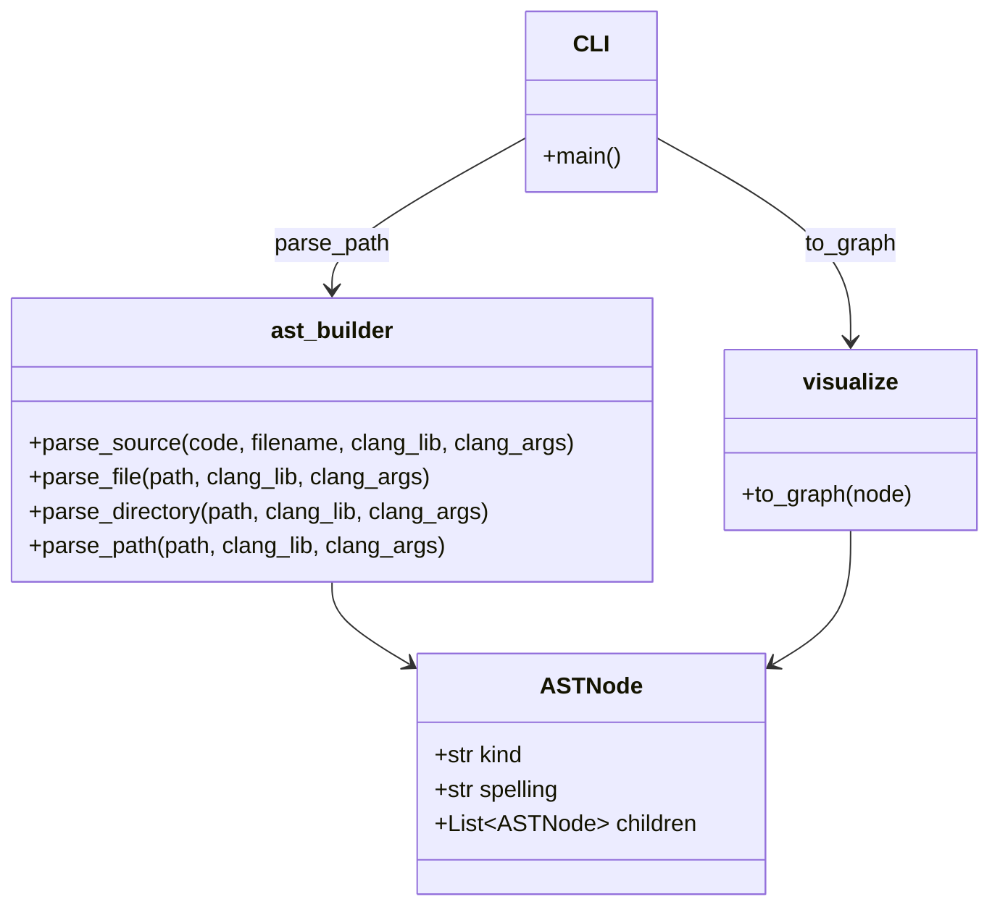

# 초기 설계 문서

본 문서는 [`SRS.md`](../SRS.md)에서 제시한 요구사항을 토대로 `cpp_ast_codex` 프로젝트의 초기 설계를 정리한다.

## 주요 모듈

- **AST Builder** (`cpp_ast_codex/ast_builder.py`)
  - `ASTNode` 데이터 클래스: AST 노드 정보를 표현한다.
  - `parse_source`, `parse_file`, `parse_directory`, `parse_path` 함수: libclang을 이용해 소스코드 또는 디렉터리를 파싱하여 `ASTNode` 트리로 변환한다.
- **시각화 모듈** (`cpp_ast_codex/visualize.py`)
  - `to_graph` 함수: `ASTNode` 트리를 Graphviz `Digraph` 객체로 변환한다.
- **명령줄 도구** (`generate_ast_image.py`)
  - 입력 경로와 출력 파일명을 받아 AST 이미지를 생성한다.

## 처리 흐름

1. CLI에서 파일 또는 디렉터리 경로를 입력받는다.
2. `parse_path` 함수가 해당 경로를 탐색하여 `ASTNode` 트리를 생성한다.
3. `to_graph` 함수가 AST를 Graphviz 그래프 형태로 변환한다.
4. 그래프를 이미지(PNG)로 저장하여 결과를 사용자에게 제공한다.

## 클래스 다이어그램

아래 다이어그램은 주요 클래스와 함수 간의 관계를 단순화하여 표현한다.

위 구조를 바탕으로 세부 기능을 확장하며 구현을 진행한다.
